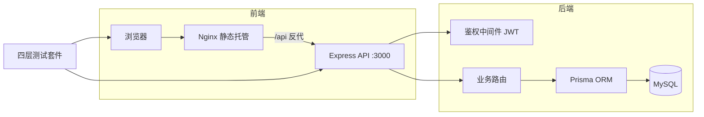

# MiniSaaS ERP


> 多租户风格的迷你 SaaS 进销存（ERP）系统：登录鉴权、商品、客户、订单（事务扣库存）、数据看板。
> 技术栈与"AI 全栈工程师（SaaS 方向）"岗位完全对齐：**Node.js + TypeScript + Express + Prisma + SQL** 后端 × **Vue 3 + TypeScript + Vite** 前端。

## ✨ 核心特性

- **JWT 鉴权**：bcrypt 密码哈希、登录失败限流（5 次锁定 15 分钟）、token 过期/篡改校验
- **订单核心链路**：数据库事务扣减库存、取消自动回补、状态机流转（禁止跳级）、幂等键防重复提交
- **金额可信**：客户端伪造金额/单价不生效，后端按数据库单价重算
- **数据看板**：统计口径正确（已取消订单不计入营收）
- **质量保障**：严格入参校验、统一错误分级（400/404/413/500）、四层测试套件 106 例全绿

## 🛠 技术栈

| 层   | 技术                                                                        |
| ---- | --------------------------------------------------------------------------- |
| 后端 | Node.js + TypeScript + Express + Prisma ORM + MySQL |
| 前端 | Vue 3 + TypeScript + Vite + Element Plus + Vue Router + Axios               |
| 鉴权 | JWT（jsonwebtoken）+ bcryptjs                                               |
| 安全 | helmet 安全头 + CORS 白名单 + 入参校验                                      |
| 质量 | ESLint + Prettier + TypeScript strict + GitHub Actions CI                   |
| 部署 | Docker / docker-compose（Nginx 托管前端 + API 反代）                        |

## 🏗 架构



## 📁 目录结构

```
├── server/                  # 后端
│   ├── prisma/
│   │   ├── schema.prisma    # 数据模型（5 张表 + 幂等键唯一约束）
│   │   └── seed.ts          # 演示数据（可重复执行）
│   ├── src/
│   │   ├── index.ts         # 入口：helmet/CORS/路由/统一错误处理
│   │   ├── logger.ts        # 结构化日志
│   │   ├── validate.ts      # 严格入参校验（价格/数量/长度/类型）
│   │   ├── errors.ts        # 统一错误体系（HttpError/BizError）
│   │   ├── middleware/auth.ts  # JWT 签发与鉴权中间件
│   │   └── routes/          # auth/products/customers/orders/dashboard
│   └── Dockerfile           # 多阶段构建
├── web/                     # 前端
│   ├── src/
│   │   ├── api/index.ts     # axios 封装（自动带 token、401 拦截）
│   │   ├── router/          # 路由 + 登录守卫
│   │   ├── store/auth.ts    # 登录状态
│   │   └── views/           # 登录/布局/看板/商品/客户/订单
│   ├── Dockerfile           # Nginx 托管
│   └── nginx.conf           # SPA 回退 + API 反代
├── tests/                   # 四层测试套件（零依赖框架 + Playwright）
├── .github/workflows/ci.yml # CI：lint/typecheck/build/测试
└── docker-compose.yml       # 一键编排
```

## 🚀 快速开始

> 要求：Node.js ≥ 20（推荐 24，见 `.nvmrc`）

### 方式一：npm workspaces（推荐）

```bash
npm install          # 安装全部 workspace 依赖
npm run db:push      # 建表（server 目录，生成 dev.db）
npm run db:seed      # 写入演示数据
npm run dev          # 同时启动后端(3000) + 前端(5173)
```

打开 http://localhost:5173 ，登录 `admin / admin123`。

### 方式二：分目录手动启动

```bash
# 终端 A —— 后端
cd server && npm install && npx prisma db push && npm run db:seed && npm run dev

# 终端 B —— 前端
cd web && npm install && npm run dev
```

### 方式三：Docker

```bash
docker compose up --build
# 访问 http://localhost:8080
```

## 🔐 环境变量

| 变量                | 位置        | 说明                                     |
| ------------------- | ----------- | ---------------------------------------- |
| `PORT`              | server/.env | API 端口，默认 3000                      |
| `JWT_SECRET`        | server/.env | JWT 签名密钥，**生产必须替换为强随机串** |
| `DATABASE_URL`      | server/.env | MySQL 连接串（本地或云数据库）        |
| `CORS_ORIGINS`      | server/.env | CORS 白名单（逗号分隔）                  |
| `VITE_API_BASE_URL` | web/.env    | 前端 API 地址（留空走 Vite 代理）        |

模板见 `server/.env.example` 与 `web/.env.example`，复制为 `.env` 后填写（`.env` 已被 git 忽略）。

## 🧪 测试

四层测试套件（`tests/`），修复回归后 **106/106 通过**：

| 层                  | 命令                    | 说明                                   |
| ------------------- | ----------------------- | -------------------------------------- |
| 接口层（56 例）     | `npm run test:api`      | 全接口正/反向/边界/异常                |
| 安全专项（23 例）   | `npm run test:security` | 注入/XSS/越权/限流/信息泄露            |
| 并发健壮性（6 例）  | `npm run test:stress`   | 超卖/幂等/一致性                       |
| Chrome E2E（21 例） | `npm run test:ui`       | 真实浏览器全流程（需先 `npm run dev`） |

```bash
npm run dev          # 先启动前后端
npm test             # 跑 API + 安全 + 并发
npm run test:ui      # 跑 Chrome E2E（依赖本机 Chrome）
```

测试报告与截图见 `tests/report/`。

## 📡 API 一览

鉴权：请求头 `Authorization: Bearer <token>`

| 方法            | 路径                     | 说明                                           | 鉴权 |
| --------------- | ------------------------ | ---------------------------------------------- | ---- |
| POST            | `/api/auth/login`        | 登录（带失败限流）                             | 否   |
| POST            | `/api/auth/register`     | 注册                                           | 否   |
| GET             | `/api/dashboard/stats`   | 看板统计                                       | 是   |
| GET             | `/api/products?q=`       | 商品列表（搜索）                               | 是   |
| POST/PUT/DELETE | `/api/products[/:id]`    | 商品增改删（外键保护）                         | 是   |
| GET             | `/api/customers`         | 客户列表                                       | 是   |
| POST/PUT/DELETE | `/api/customers[/:id]`   | 客户增改删                                     | 是   |
| GET             | `/api/orders`            | 订单列表                                       | 是   |
| POST            | `/api/orders`            | 创建订单（事务扣库存，支持 `Idempotency-Key`） | 是   |
| PATCH           | `/api/orders/:id/status` | 状态流转（状态机校验，取消回补库存）           | 是   |

## 🗄 数据模型

```
User（用户）1 ── n Order（订单）n ── 1 Customer（客户）
Order（订单）1 ── n OrderItem（明细）n ── 1 Product（商品）
```

设计要点：明细存下单时单价快照（改价不影响历史订单）、订单号时间戳+随机串防撞号、幂等键唯一约束持久化防重。

## 🤝 开发规范

- 代码规范：ESLint（`npm run lint`）+ Prettier（`npm run format`），提交前必须零告警
- 类型检查：`npm run typecheck`（TS strict）
- 提交信息：[Conventional Commits](https://www.conventionalcommits.org/zh-hans/)
- 详见 [CONTRIBUTING.md](./CONTRIBUTING.md)

## 📄 文档索引

- [Changelog](./CHANGELOG.md) · [贡献指南](./CONTRIBUTING.md) · [MIT License](./LICENSE)

## ⚠️ 已知限制（演示定位）

- 登录限流为内存实现，多实例部署需换 Redis
- 未做分页/细粒度 RBAC/单元测试覆盖（架构已留扩展点）
- 生产建表使用 `prisma db push`（开发便捷）；正式多环境应改用 `prisma migrate deploy` 管理迁移
